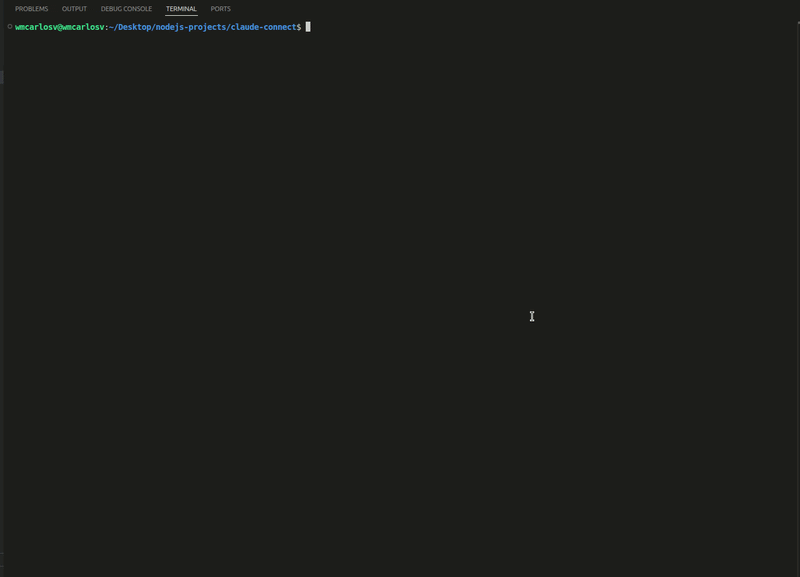

# Claude Connect

> Conecta `Claude Code` con `OpenCode Go`, `Zen`, `Kimi`, `DeepSeek`, `Z.AI`, `Kilo Code Models`, `Ollama`, `Ollama Cloud Models`, `NVIDIA NIM`, `OpenAI`, `Inception Labs`, `OpenRouter`, `Seto Kaiba` y `Qwen` desde una interfaz de consola clara, rápida y reversible.

[](https://www.npmjs.com/package/claude-connect)
[](https://nodejs.org/)
[](./LICENSE)
[](https://www.npmjs.com/package/claude-connect)

<p align="center">
  
</p>

## Why Claude Connect

`Claude Connect` te permite cambiar `Claude Code` hacia otros proveedores sin editar archivos a mano, sin perder tu configuración original y sin convertir tu terminal en un caos de variables de entorno.

### Highlights

- `OpenCode Go`, `Zen`, `Kimi`, `DeepSeek`, `Z.AI`, `Kilo Code Models`, `Ollama`, `Ollama Cloud Models`, `NVIDIA NIM`, `OpenAI`, `Inception Labs`, `OpenRouter`, `Seto Kaiba` y `Qwen` listos desde el primer arranque
- soporte para `Token` y `OAuth` cuando el proveedor lo permite
- API keys compartidas por proveedor para no repetir el mismo token en cada modelo
- activación reversible sobre la instalación real de `Claude Code`
- limpieza automática del conflicto entre `claude.ai` y `ANTHROPIC_API_KEY`
- gateway local Anthropic-compatible para `Qwen`
- detección automática de rutas en Linux y Windows
- catálogo local generado desde seeds, sin dependencias nativas
- interfaz de consola con navegación simple y profesional
- listas largas paginadas de `5 en 5` para que la UI no se rompa con catálogos grandes

## Package

- npm: https://www.npmjs.com/package/claude-connect
- repo: https://github.com/wmcarlosv/claude-connect

## Install

Instalación global:

```bash
npm install -g claude-connect
claude-connect
```

Instalación simple en proyecto:

```bash
npm i claude-connect
```

Ejecución con `npx`:

```bash
npx claude-connect
```

Desarrollo local:

```bash
npm start
```

Requisito:

- `Node.js 18` o superior

## Quick Flow

```text
Nueva conexion
  -> proveedor
  -> modelo
  -> OAuth o Token
  -> guardar API key una vez por proveedor si aplica
  -> guardar perfil
  -> Activar en Claude
  -> usar claude
```

Al activar:

- `OpenCode Go` usa conexión directa o gateway según el modelo elegido
- `Zen` usa conexión directa o gateway según el modelo elegido
- `Kimi` usa gateway local y reenvia al endpoint Anthropic de `https://api.kimi.com/coding/`
- `DeepSeek` apunta a `https://api.deepseek.com/anthropic`
- `Z.AI` apunta a `https://api.z.ai/api/anthropic`
- `Kilo Code Models` consulta `https://api.kilo.ai/api/gateway/models`, lista modelos gratis y pagos, y usa `https://api.kilo.ai/api/gateway/chat/completions`
- `Ollama` pide una URL local o remota, valida `/api/tags` y usa el gateway local sobre `.../api/chat`
- `Ollama Cloud Models` consulta `https://ollama.com/api/tags` con `OLLAMA_API_KEY`, usa los modelos que realmente devuelve tu cuenta y trabaja sobre `https://ollama.com/api/chat`
- `NVIDIA NIM` consulta `https://integrate.api.nvidia.com/v1/models`, filtra modelos de coding y usa `https://integrate.api.nvidia.com/v1/chat/completions`
- `OpenAI` usa el gateway local sobre `https://api.openai.com/v1/chat/completions`
- `Inception Labs` usa el gateway local sobre `https://api.inceptionlabs.ai/v1/chat/completions`
- `OpenRouter` usa `openrouter/free` y modelos `:free` descubiertos desde `https://openrouter.ai/api/v1/models`
- `Seto Kaiba` usa el gateway local como router virtual y rota entre conexiones gratuitas ya configuradas cuando encuentra cuota o rate limit
- `Qwen` apunta al gateway local `http://127.0.0.1:4310/anthropic`
- para algunos modelos con limites conocidos, el gateway ahora ajusta `max_tokens` y bloquea prompts sobredimensionados antes de que el upstream devuelva errores opacos
- para `Inception Labs`, el gateway tambien respeta un presupuesto local de input tokens por minuto para reducir errores de `Rate limit reached`

## Providers

| Proveedor | Modelos | Auth | Integración |
| --- | --- | --- | --- |
| `OpenCode Go` | `glm-5`, `kimi-k2.5`, `minimax-m2.7`, `minimax-m2.5` | `Token` | Mixta |
| `Zen` | `Claude*` de Zen + modelos `chat/completions` de Zen | `Token` | Mixta |
| `Kimi` | `kimi-for-coding` | `Token` | Gateway local |
| `DeepSeek` | `deepseek-chat`, `deepseek-reasoner` | `Token` | Directa |
| `Z.AI` | `glm-5.1`, `glm-4.7`, `glm-4.5-air` | `Token` | Directa |
| `Kilo Code Models` | modelos gratis y pagos descubiertos desde `/models` | `Gratis sin token`, `Token` | Gateway local |
| `Ollama` | modelos descubiertos desde tu servidor | `Servidor Ollama` | Gateway local |
| `Ollama Cloud Models` | modelos cloud descubiertos desde `ollama.com/api/tags` | `Token` | Gateway local |
| `NVIDIA NIM` | modelos de coding descubiertos desde `/models` | `Token` | Gateway local |
| `OpenAI` | `gpt-5.4`, `gpt-5.4-mini`, `gpt-5.3-codex`, `gpt-5.2-codex`, `gpt-5.2`, `gpt-5.1-codex-max`, `gpt-5.1-codex-mini` | `Token` | Gateway local |
| `Inception Labs` | `mercury-2` | `Token` | Gateway local |
| `OpenRouter` | `openrouter/free` + modelos `:free` descubiertos en vivo | `Token` | Gateway local |
| `Seto Kaiba` | `s-kaiba` | `Automatico` | Gateway local |
| `Qwen` | `qwen3-coder-plus` | `OAuth`, `Token` | Gateway local |

Nota sobre `OpenCode Go`:

- `minimax-m2.7` y `minimax-m2.5` van directos por endpoint `messages`
- `glm-5` y `kimi-k2.5` van por gateway usando `chat/completions`

Nota sobre `Zen`:

- los modelos Anthropic de Zen van por conexión directa
- los modelos de Zen servidos por `chat/completions` van por gateway local
- esta primera integración no incluye todavía los modelos de Zen expuestos por `responses` ni los de endpoint tipo Google

Nota sobre `OpenAI`:

- esta integración usa `Chat Completions` por `gateway local`
- el bridge actual encaja bien con los modelos GPT/Codex listados porque Claude Code sigue hablando Anthropic hacia `claude-connect`
- la autenticación soportada hoy es `API key`; no se expone `OAuth` para este proveedor
- `gpt-5.4` quedó validado con una llamada real a través del gateway local
- referencia oficial:
  - https://platform.openai.com/docs/api-reference/chat/create
  - https://platform.openai.com/docs/api-reference/authentication
  - https://developers.openai.com/api/docs/models

Nota sobre `Inception Labs`:

- esta primera integracion expone solo `mercury-2`, que es el modelo chat-compatible oficial en `v1/chat/completions`
- `mercury-2` se trata como modelo solo texto en Claude Connect; si envias una imagen, la app ahora corta la peticion con un mensaje claro
- Claude Connect aplica presupuesto preventivo de contexto para `mercury-2` usando ventana `128K` y salida maxima `16,384`
- Claude Connect tambien aplica una ventana deslizante local de `400,000` input tokens por minuto para reducir rechazos del upstream por rate limit
- `Mercury Edit 2` no se publica todavia en Claude Connect porque usa endpoints `fim/edit` que no encajan con Claude Code en esta arquitectura
- autenticacion soportada: `API key`
- referencias oficiales:
  - https://docs.inceptionlabs.ai/get-started/get-started
  - https://docs.inceptionlabs.ai/get-started/authentication
  - https://docs.inceptionlabs.ai/get-started/models
  - https://docs.inceptionlabs.ai/get-started/rate-limits

Nota sobre `DeepSeek`:

- Claude Connect aplica presupuesto preventivo de contexto para `deepseek-chat` y `deepseek-reasoner`
- referencias oficiales:
  - https://api-docs.deepseek.com/quick_start/pricing/
  - https://api-docs.deepseek.com/guides/reasoning_model

Nota sobre `Z.AI`:

- usa el endpoint Anthropic-compatible oficial `https://api.z.ai/api/anthropic`
- Claude Connect fija `API_TIMEOUT_MS=3000000`
- al activar un perfil de `Z.AI`, tambien mapea `ANTHROPIC_DEFAULT_HAIKU_MODEL`, `ANTHROPIC_DEFAULT_SONNET_MODEL` y `ANTHROPIC_DEFAULT_OPUS_MODEL` al modelo elegido para que Claude Code use `GLM` de forma consistente
- referencias oficiales:
  - https://docs.z.ai/devpack/tool/claude

Nota sobre `Kilo Code Models`:

- la app consulta `GET https://api.kilo.ai/api/gateway/models`
- lista modelos gratis y pagos desde el gateway de Kilo
- los modelos gratuitos pueden usarse en modo anonimo
- los modelos de pago requieren `KILO_API_KEY`
- referencias oficiales:
  - https://kilo.ai/docs/gateway
  - https://kilo.ai/docs/gateway/models-and-providers
  - https://kilo.ai/docs/gateway/api-reference

Nota sobre `Ollama`:

- la URL del servidor se define al crear la conexión
- sirve tanto para `localhost` como para un VPS o servidor remoto con Ollama expuesto
- Claude Connect consulta `/api/tags` para listar modelos y validar la conexión antes de guardar
- luego usa el endpoint nativo `POST /api/chat`, que resultó más compatible para servidores remotos que publican mal `/v1/*`
- servidores remotos pueden seguir fallando por timeout, auth cloud o respuestas pobres del modelo; la app ya distingue mejor esos casos
- referencia oficial:
  - https://docs.ollama.com/openai
  - https://docs.ollama.com/api/tags

Nota sobre `Ollama Cloud Models`:

- la app consulta `GET https://ollama.com/api/tags` con `OLLAMA_API_KEY`
- Ollama no expone un flag oficial `free` en ese endpoint
- Claude Connect usa los modelos que realmente devuelve `ollama.com/api/tags` para tu cuenta; si aparecen sufijos cloud los respeta, y si no aparecen usa la lista devuelta igualmente
- la disponibilidad real depende de tu cuenta/plan de Ollama
- referencias oficiales:
  - https://docs.ollama.com/cloud
  - https://docs.ollama.com/api/authentication
  - https://docs.ollama.com/api/tags

Nota sobre `NVIDIA NIM`:

- usa `https://integrate.api.nvidia.com/v1/chat/completions` con `NVIDIA_API_KEY`
- la selección de modelos es dinámica: Claude Connect consulta `GET https://integrate.api.nvidia.com/v1/models`
- solo muestra modelos orientados a programación según señales como `coder`, `code`, `devstral`, `kimi`, `deepseek`, `minimax`, `nemotron`, `qwen`, `glm` y `gpt-oss`
- `moonshotai/kimi-k2.5` se detecta como modelo multimodal con ventana `256K` según la documentación de NVIDIA
- Claude Connect lo trata como proveedor `OpenAI-compatible` por gateway local, por lo que Claude Code sigue usando la interfaz Anthropic local
- para `moonshotai/kimi-k2.5`, el gateway agrega `chat_template_kwargs.thinking=true` y aplica presupuesto preventivo de contexto `256K`
- referencias oficiales:
  - https://docs.api.nvidia.com/nim/reference/moonshotai-kimi-k2-5

Nota sobre `Seto Kaiba`:

- es un proveedor virtual de `Claude Connect`, no un upstream externo
- al crearlo, eliges exactamente qué conexiones gratuitas quieres usar
- solo admite perfiles que pasan por nuestro gateway local, no conexiones directas
- si el proveedor actual devuelve errores de cuota, creditos agotados o rate limit, intenta la siguiente conexión gratuita compatible
- no rota en errores de validación ni a mitad de una respuesta
- sirve para exprimir proveedores free sin tener que ir cambiando de perfil manualmente

Nota sobre `OpenRouter`:

- la app mantiene `openrouter/free` como router estable del catálogo base
- además consulta `GET https://openrouter.ai/api/v1/models` para listar variantes `:free` y otros modelos con pricing `0`
- si la consulta en vivo falla, sigue quedando disponible `openrouter/free`

## What It Stores

Claude Connect guarda el estado sensible fuera del repo.

Rutas por defecto:

```text
Linux: ~/.claude-connect
Windows: %APPDATA%\claude-connect
```

Ahí viven:

- perfiles
- tokens OAuth
- API keys compartidas por proveedor
- estado del switch de Claude
- logs y estado del gateway

Importante sobre el catálogo:

- el catálogo se siembra desde `src/data/catalog-store.js`
- no depende de `node:sqlite`, por eso funciona desde `Node.js 18`
- no crea una base de datos en la carpeta donde ejecutas el comando
- esto evita conflictos molestos al hacer `git pull` y carpetas `storage/` accidentales en proyectos ajenos

## Claude Code Switching

Cuando activas un perfil, la app modifica la configuración real detectada de `Claude Code` y guarda un snapshot reversible.

Archivos implicados:

- `settings.json`
- `~/.claude.json`
- `.credentials.json`

Eso permite:

- activar otro proveedor sin tocar archivos manualmente
- evitar el `Auth conflict` entre sesión `claude.ai` y `API key`
- volver a tu estado original con `Revertir Claude`
- bloquear la activación si `Claude Code` no está realmente instalado todavía

## Qwen OAuth

`Qwen` usa el device flow oficial de `Qwen Code`.

URL típica de autorización:

```text
https://chat.qwen.ai/auth?user_code=XXXXX&client=qwen-code
```

Comportamiento actual:

- intenta abrir el navegador por defecto
- también deja la URL visible para copiar y pegar manualmente
- en Windows ya se corrigió la apertura del navegador

## Console UX

- `Volver` aparece como opción visible en listas
- `Tab` vuelve a la pantalla anterior cuando aplica
- `Esc` una vez avisa
- `Esc` dos veces sale
- después de crear o editar una conexión, regresas al menú principal

## Development

Pruebas:

```bash
npm test
```

Puntos principales del código:

- entrada principal: `src/wizard.js`
- catálogo: `src/data/catalog-store.js`
- switch de Claude: `src/lib/claude-settings.js`
- OAuth de Qwen: `src/lib/oauth.js`
- gateway local: `src/gateway/server.js`

## Publish Notes

El paquete npm publica solo lo necesario:

- `bin/claude-connect.js`
- `src/`
- `README.md`
- `LICENSE`

El tarball ya está preparado para distribución limpia.
